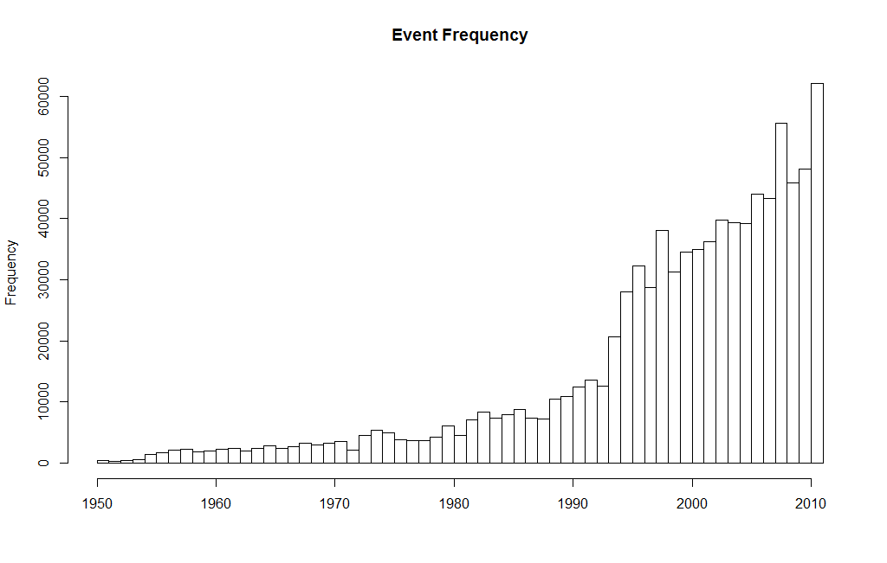
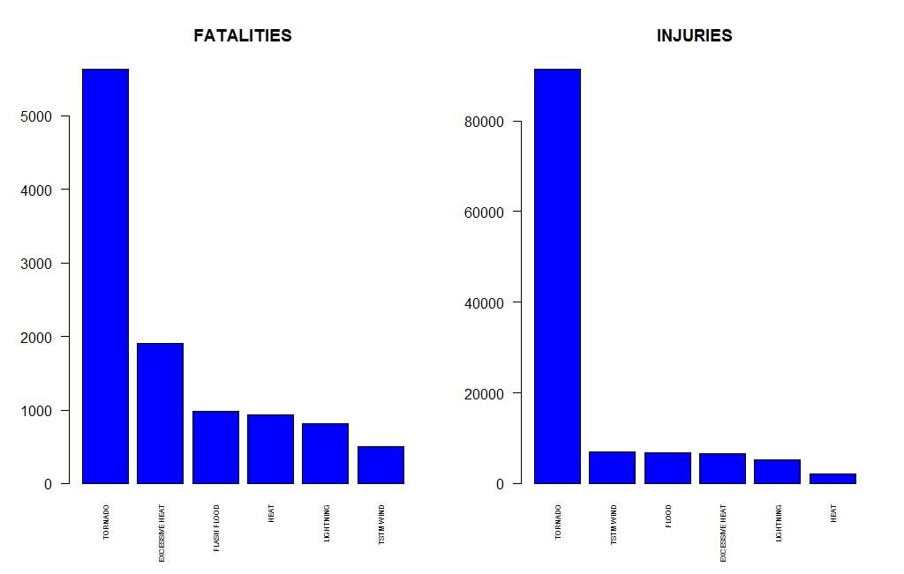
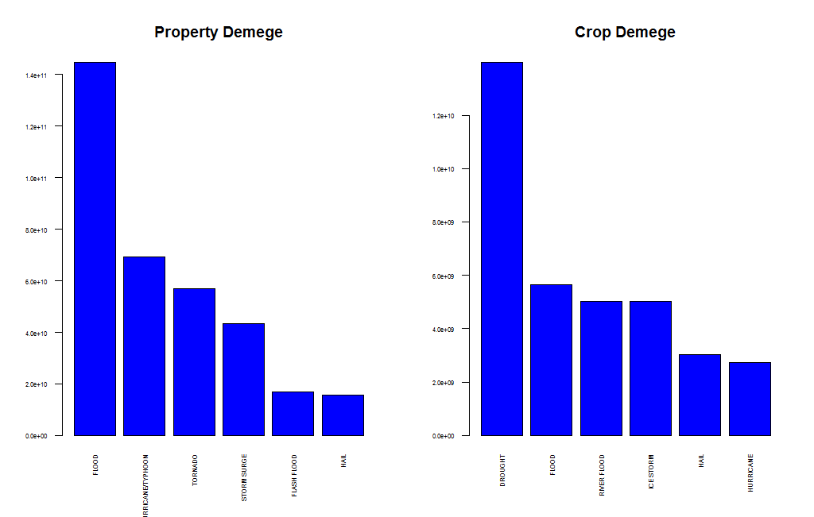

## Synopsis

Storms and other severe weather events can cause both public health and economic problems for communities and municipalities. Many severe events can result in fatalities, injuries, and property damage, and preventing such outcomes to the extent possible is a key concern.

This project involves exploring the U.S. National Oceanic and Atmospheric Administration's (NOAA) storm database. This database tracks characteristics of major storms and weather events in the United States, including when and where they occur, as well as estimates of any fatalities, injuries, and property damage.

Now, we will analysis the NOAA Storm Database and find out which weather event will most destroy public safety and economic. We will focus on the following questions:

1. Across the United States, which types of events (as indicated in the EVTYPE variable) are most harmful with respect to population health?

2. Across the United States, which types of events have the greatest economic consequences?


## Data Processing

Load the source data to memory for analysis and print some base information of the dataset.


```r
if(!file.exists("StormData.csv")) { 
    ZipFile <- "./StormData.csv.bz2"
    if(!file.exists(ZipFile)) {
        ZipURL <- "https://d396qusza40orc.cloudfront.net/repdata%2Fdata%2FStormData.csv.bz2"
        download.file(url=ZipURL,destfile=ZipFile,method="auto")
    }  
    bunzip2("./stormData.csv.bz2", overwrite=T, remove=F)
	if (file.exists("StormData.csv")) file.remove("./stormData.csv.bz2")
}

Storm <- read.csv("./StormData.csv", header=TRUE, sep=",")
dim(Storm)
```

```
## [1] 902297     37
```

```r
names(Storm)
```

```
##  [1] "STATE__"    "BGN_DATE"   "BGN_TIME"   "TIME_ZONE"  "COUNTY"    
##  [6] "COUNTYNAME" "STATE"      "EVTYPE"     "BGN_RANGE"  "BGN_AZI"   
## [11] "BGN_LOCATI" "END_DATE"   "END_TIME"   "COUNTY_END" "COUNTYENDN"
## [16] "END_RANGE"  "END_AZI"    "END_LOCATI" "LENGTH"     "WIDTH"     
## [21] "F"          "MAG"        "FATALITIES" "INJURIES"   "PROPDMG"   
## [26] "PROPDMGEXP" "CROPDMG"    "CROPDMGEXP" "WFO"        "STATEOFFIC"
## [31] "ZONENAMES"  "LATITUDE"   "LONGITUDE"  "LATITUDE_E" "LONGITUDE_"
## [36] "REMARKS"    "REFNUM"
```

```r
str(Storm)
```

```
## 'data.frame':	902297 obs. of  37 variables:
##  $ STATE__   : num  1 1 1 1 1 1 1 1 1 1 ...
##  $ BGN_DATE  : Factor w/ 16335 levels "1/1/1966 0:00:00",..: 6523 6523 4242 11116 2224 2224 2260 383 3980 3980 ...
##  $ BGN_TIME  : Factor w/ 3608 levels "00:00:00 AM",..: 272 287 2705 1683 2584 3186 242 1683 3186 3186 ...
##  $ TIME_ZONE : Factor w/ 22 levels "ADT","AKS","AST",..: 7 7 7 7 7 7 7 7 7 7 ...
##  $ COUNTY    : num  97 3 57 89 43 77 9 123 125 57 ...
##  $ COUNTYNAME: Factor w/ 29601 levels "","5NM E OF MACKINAC BRIDGE TO PRESQUE ISLE LT MI",..: 13513 1873 4598 10592 4372 10094 1973 23873 24418 4598 ...
##  $ STATE     : Factor w/ 72 levels "AK","AL","AM",..: 2 2 2 2 2 2 2 2 2 2 ...
##  $ EVTYPE    : Factor w/ 985 levels "   HIGH SURF ADVISORY",..: 834 834 834 834 834 834 834 834 834 834 ...
##  $ BGN_RANGE : num  0 0 0 0 0 0 0 0 0 0 ...
##  $ BGN_AZI   : Factor w/ 35 levels "","  N"," NW",..: 1 1 1 1 1 1 1 1 1 1 ...
##  $ BGN_LOCATI: Factor w/ 54429 levels "","- 1 N Albion",..: 1 1 1 1 1 1 1 1 1 1 ...
##  $ END_DATE  : Factor w/ 6663 levels "","1/1/1993 0:00:00",..: 1 1 1 1 1 1 1 1 1 1 ...
##  $ END_TIME  : Factor w/ 3647 levels ""," 0900CST",..: 1 1 1 1 1 1 1 1 1 1 ...
##  $ COUNTY_END: num  0 0 0 0 0 0 0 0 0 0 ...
##  $ COUNTYENDN: logi  NA NA NA NA NA NA ...
##  $ END_RANGE : num  0 0 0 0 0 0 0 0 0 0 ...
##  $ END_AZI   : Factor w/ 24 levels "","E","ENE","ESE",..: 1 1 1 1 1 1 1 1 1 1 ...
##  $ END_LOCATI: Factor w/ 34506 levels "","- .5 NNW",..: 1 1 1 1 1 1 1 1 1 1 ...
##  $ LENGTH    : num  14 2 0.1 0 0 1.5 1.5 0 3.3 2.3 ...
##  $ WIDTH     : num  100 150 123 100 150 177 33 33 100 100 ...
##  $ F         : int  3 2 2 2 2 2 2 1 3 3 ...
##  $ MAG       : num  0 0 0 0 0 0 0 0 0 0 ...
##  $ FATALITIES: num  0 0 0 0 0 0 0 0 1 0 ...
##  $ INJURIES  : num  15 0 2 2 2 6 1 0 14 0 ...
##  $ PROPDMG   : num  25 2.5 25 2.5 2.5 2.5 2.5 2.5 25 25 ...
##  $ PROPDMGEXP: Factor w/ 19 levels "","-","?","+",..: 17 17 17 17 17 17 17 17 17 17 ...
##  $ CROPDMG   : num  0 0 0 0 0 0 0 0 0 0 ...
##  $ CROPDMGEXP: Factor w/ 9 levels "","?","0","2",..: 1 1 1 1 1 1 1 1 1 1 ...
##  $ WFO       : Factor w/ 542 levels ""," CI","$AC",..: 1 1 1 1 1 1 1 1 1 1 ...
##  $ STATEOFFIC: Factor w/ 250 levels "","ALABAMA, Central",..: 1 1 1 1 1 1 1 1 1 1 ...
##  $ ZONENAMES : Factor w/ 25112 levels "","                                                                                                                               "| __truncated__,..: 1 1 1 1 1 1 1 1 1 1 ...
##  $ LATITUDE  : num  3040 3042 3340 3458 3412 ...
##  $ LONGITUDE : num  8812 8755 8742 8626 8642 ...
##  $ LATITUDE_E: num  3051 0 0 0 0 ...
##  $ LONGITUDE_: num  8806 0 0 0 0 ...
##  $ REMARKS   : Factor w/ 436774 levels "","-2 at Deer Park\n",..: 1 1 1 1 1 1 1 1 1 1 ...
##  $ REFNUM    : num  1 2 3 4 5 6 7 8 9 10 ...
```

The dataset is very large which have nearly a million records and 37 columns. But we will focuse on 7 columns as below for answering two required questions about population harmful and economic loss.

EVTYPE: Event Type (e.g. tornado, flood, etc.)  
FATALITIES: Number of fatalities  
INJURIES: Number of injuries  
PROPDMG: Property damage estimates, entered as actual dollar amounts  
PROPDMGEXP: Alphabetic Codes to signify magnitude "K" for thousands, "M" for millions, and "B" for billions)  
CROPDMG: Crop damage estimates, entered as actual dollar amounts  
CROPDMGEXP: Alphabetic Codes to signify magnitude "K" for thousands, "M" for millions, and "B" for billions)


### Data Cleansing

For better analysis of event type, we use the upper case and trim the leading and eanding space.


```r
Storm$BGN_DATE <- as.Date(Storm$BGN_DATE,"%m/%d/%Y %H:%M:%S")
#sort(unique(Storm$EVTYPE))
trimSpace <- function (x) gsub("^\\s+|\\s+$", "", x)
Storm$EVTYPE <- trimSpace(toupper(Storm$EVTYPE))
```


We will convert the property damage and crop damage data into comparable numerical forms according to the meaning of units. Both PROPDMGEXP and CROPDMGEXP columns record a multiplier for each observation where we have Hundred (H), Thousand (K), Million (M) and Billion (B).


```r
PROPDMGEXP  <- levels(Storm$PROPDMGEXP)
PROPDMGEXP
```

```
##  [1] ""  "-" "?" "+" "0" "1" "2" "3" "4" "5" "6" "7" "8" "B" "h" "H" "K"
## [18] "m" "M"
```

```r
PropPower <- c(0,0,0,0,0,1,2,3,4,5,6,7,8,9,2,2,3,6,6)
PropLookup <- data.frame(cbind(PROPDMGEXP,PropPower))
PropLookup
```

```
##    PROPDMGEXP PropPower
## 1                     0
## 2           -         0
## 3           ?         0
## 4           +         0
## 5           0         0
## 6           1         1
## 7           2         2
## 8           3         3
## 9           4         4
## 10          5         5
## 11          6         6
## 12          7         7
## 13          8         8
## 14          B         9
## 15          h         2
## 16          H         2
## 17          K         3
## 18          m         6
## 19          M         6
```

```r
CROPDMGEXP <- levels(Storm$CROPDMGEXP)  
CropPower <- c(0,0,0,2,9,3,3,6,6)
CropLookup <- data.frame(cbind(CROPDMGEXP,CropPower))
CropLookup
```

```
##   CROPDMGEXP CropPower
## 1                    0
## 2          ?         0
## 3          0         0
## 4          2         2
## 5          B         9
## 6          k         3
## 7          K         3
## 8          m         6
## 9          M         6
```

```r
Storm <- merge(Storm,PropLookup)
Storm <- merge(Storm,CropLookup)

Storm$PropPower <- as.numeric(as.character(Storm$PropPower))
Storm$CropPower <- as.numeric(as.character(Storm$CropPower))
```


## Results


```r
hist(as.numeric(format(Storm$BGN_DATE,"%Y")),60,main="Event Frequency")
```



The graphic shows the weather event frequency by year from 1950 to 2010.


```r
require(dplyr)
Harmful <- select(Storm, c(EVTYPE,FATALITIES,INJURIES)) %>% 
           group_by(EVTYPE) %>% 
           summarize(TotalFatal=sum(FATALITIES), TotalInjury=sum(INJURIES)) %>%
		   mutate(TotalHarm=TotalFatal+TotalInjury)

fatal  <- head(arrange(Harmful,desc(TotalFatal)))
injury <- head(arrange(Harmful,desc(TotalInjury)))

par(mfrow = c(1, 2))
barplot(fatal$TotalFatal, names.arg=fatal$EVTYPE, cex.names=0.5, col="blue", main="FATALITIES", las=2)
barplot(injury$TotalInjury, names.arg=injury$EVTYPE, cex.names=0.5, col="blue", main="INJURIES", las=2)
```



Over all, TORNADO is the most harmful weather event to the population health.


```r
ecoDMG <- select(Storm, c(EVTYPE,PROPDMG,PropPower,CROPDMG,CropPower)) %>% 
          group_by(EVTYPE) %>% 
          summarize(TotalPROPDMG=sum(PROPDMG*10^PropPower), TotalCROPDMG=sum(CROPDMG*10^CropPower)) %>%
		  mutate(TotalDMG=TotalPROPDMG+TotalCROPDMG)

PROP <- head(arrange(ecoDMG,desc(TotalPROPDMG)))
CROP <- head(arrange(ecoDMG,desc(TotalCROPDMG)))

par(mfrow = c(1, 2))
barplot(PROP$TotalPROPDMG, names.arg=PROP$EVTYPE, cex.axis=0.5, cex.names=0.5, col="blue", main="Property Demege", las=2)
barplot(CROP$TotalCROPDMG, names.arg=CROP$EVTYPE, cex.axis=0.5, cex.names=0.5, col="blue", main="Crop Demege", las=2)
```



Over all, TORNADO is the most harmful weather event to the population health.


## Conclusions

Obviously, the most harmful weather event is tornado, which has caused more than 90 thousands injuries and more than 5 thousands fatalities in the past 60 years in USA. From another point of view, flooding had the greatest economic consequences, with around 150 billion dollars in property damages and around 6 billion dollars in crop damages.
